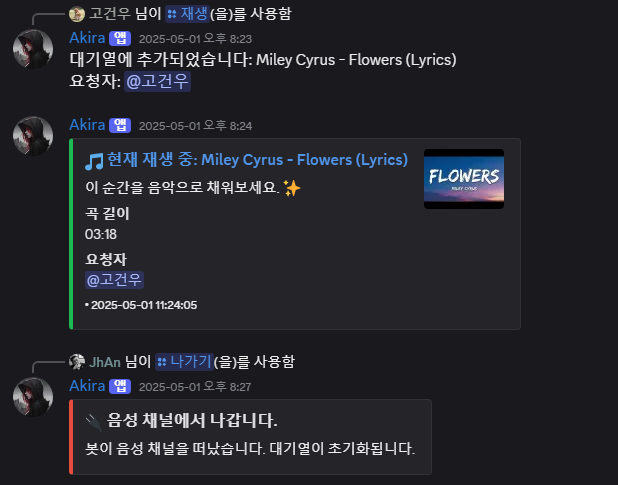

# akira-lavalink

Java 기반 Lavalink를 활용한 디스코드 음악 봇, **아키라**입니다.

---

## 주요 기능

- **음악 재생**: YouTube, Spotify 등 다양한 플랫폼에서 음악 재생 가능. (현재 Spotify는 연동하지 않음)
- **대기열 관리**: 곡을 추가하거나 삭제하며, 대기열을 확인하는 기능.
- **자동 재생**: 대기열이 비어 있으면 자동으로 연관된 곡을 재생하는 기능.
- **볼륨 조절**: 재생 중인 음악의 볼륨을 조절하는 기능.
- **곡 스킵**: 현재 재생 중인 곡을 건너뛰는 기능.
- **현재 재생 곡 표시**: 현재 재생 중인 음악 정보를 임베드로 제공.
- **편리한 자동 완성 검색**: 곡 검색 시 자동 완성을 제공하여 빠른 선택이 가능.

---

## 설치 및 실행

### 1. 필수 사항
- **Java 17 이상**
- [Lavalink](https://github.com/freyacodes/Lavalink) 서버(로컬 또는 원격 실행)
- Discord 봇 토큰

### 2. 환경 변수 설정 및 종속성 설치
`.env` 파일을 생성하고 아래 내용을 입력:
```env
BOT_TOKEN=your_discord_bot_token
```

**Linux일 경우 exec 플러그인을 사용해 실행:**
```bash
<build>
    <plugins>
        <plugin>
            <groupId>org.codehaus.mojo</groupId>
            <artifactId>exec-maven-plugin</artifactId>
            <version>3.5.0</version>
            <configuration>
                <mainClass>패키지명.Main</mainClass> <!-- Main 클래스의 전체 경로 -->
            </configuration>
        </plugin>
    </plugins>
</build>
```
```bash
mvm clean install
```

### 3. Lavalink 서버 실행
Lavalink의 `application.yml`을 설정한 후 Lavalink 서버를 실행:
```bash
java -jar Lavalink.jar
```
### 4-1. 봇 클라이언트 구동: Linux에서 호스팅하는 경우(원격)
Lavalink에서 **Oauth**를 활성화 해야할 가능성이 높음. <br>
Oauth에 관한 자세한 내용은 [youtube-soruce](https://github.com/lavalink-devs/youtube-source?tab=readme-ov-file#using-oauth-tokens) 에서 **Using OAuth Tokens** 부분 참고. <br>
Oauth 활성화 후, **봇 클라이언트**:
```bash
mvn exec:java
```
### 4-2. 봇 클라이언트 구동: Windows에서 실행(로컬)
IDE를 이용해서 `Main.java`를 실행하였음.


## 주요 명령어
| 명령어         | 설명                               | 예시                         |
|-------------|----------------------------------|----------------------------|
| `/재생`       | 음악을 재생합니다.                       | `/재생 플랫폼:YouTube 쿼리:노래 제목` |
| `/대기열 목록`   | 현재 대기열을 확인합니다.                   | `/대기열 목록`                  |
| `/대기열 초기화`  | 현재 대기열 목록을 초기화합니다.               | `/대기열 초기화`                 |
| `/스킵`       | 현재 재생 중인 곡을 건너뜁니다.               | `/스킵`                      |
| `/볼륨`       | 재생 중인 음악의 볼륨을 조절합니다.             | `/볼륨 볼륨:50`                |
| `/현재곡`      | 현재 재생 중인 곡의 정보를 확인합니다.           | `/현재곡`                     |
| `/들어가기`     | 봇을 음성 채널에 초대합니다.                 | `/들어가기`                    |
| `/나가기`      | 봇을 음성 채널에서 나가며, 대기열을 초기화합니다.     | `/나가기`                     |
| `/안녕`       | 봇이 인사 메시지를 보냅니다.                 | `/안녕`                      |
| `/정지`       | 음악 재생을 중지하고 대기열을 비웁니다.           | `/정지`                      |
| `/jpoplist` | 개발자의 추천 JPOP 플레이리스트를 대기열에 추가합니다. | `/jpoplist`                |


## 미리보기
| 실행 화면                              |
|------------------------------------|
|  |


## 기술 스택

- **Java**: 17+
- **JDA**: Discord API Wrapper
- **Lavalink**: 고성능 음악 스트리밍 서버
- **Maven**: 의존성 관리 및 빌드 도구

## Lavalink
Lavalink 설정 및 API 사용에 대한 자세한 내용은 아래의 공식 문서를 참조<br>
https://client.lavalink.dev/<br>
https://lavalink.dev/api/index.html

### 사용한 플러그인
[youtube-source](https://github.com/lavalink-devs/youtube-source)<br>
[LavaSrc](https://github.com/topi314/LavaSrc)<br>
[LavaSearch](https://github.com/topi314/LavaSearch)


## 참고 및 감사 인사
- 프로젝트 개발 초기에 방향 설정에 있어 도움을 주신 뽀삐 봇 개발자 [@siy-uuu](https://github.com/siy-uuu)님께 감사드립니다.<br>
- 뽀삐봇에서 사용된 명령어 스타일(예: 한국어 기반 명령어 이름 등)을 참고하였습니다.