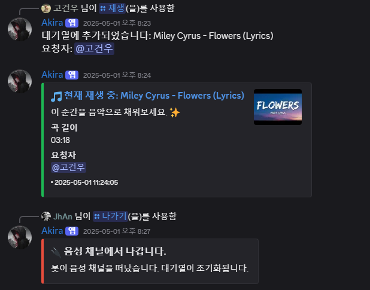
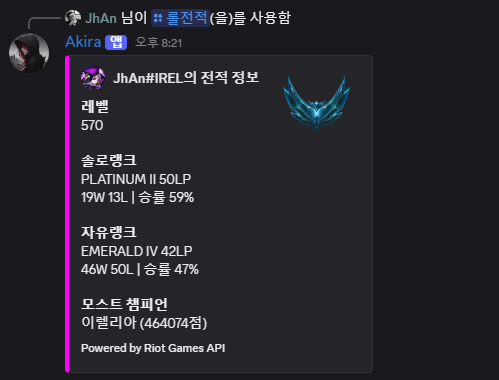
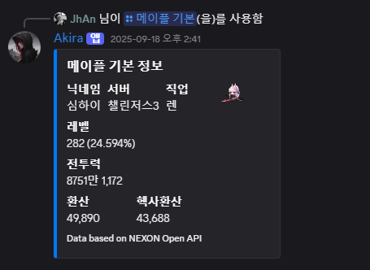
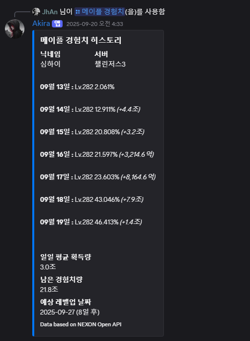

# akira-lavalink

Java, JDA, Lavalink를 기반으로 개발한 Discord 음악 봇 **아키라(Akira)** 입니다.

음악 재생 및 대기열 관리 기능을 중심으로 시작했으며, 이후 Riot Games API와 NEXON Open API를 연동하여 게임 정보 조회 기능을 추가했습니다.

> [!IMPORTANT]
> ## 개발 및 운영 중단 안내
>
> **2025년 9월을 마지막으로 기능 개발을 중단했으며, 서버 운영 비용 문제로 현재 상시 운영 또한 중단된 상태입니다.**
>
> 저장소는 개발 기록 및 참고용으로 유지하고 있으며, 현재 재개 일정은 정해져 있지 않습니다.
>
> Discord API, Lavalink, YouTube 및 외부 API의 변경에 따라 아래 설치 방법이나 일부 기능이 현재 환경에서는 정상적으로 동작하지 않을 수 있습니다.

## 프로젝트 주요 업데이트

- **2025.05** — Riot Games API를 활용한 **League of Legends 전적 조회 기능** 추가
- **2025.09** — NEXON Open API를 활용한 **메이플스토리 캐릭터 정보 및 경험치 히스토리 기능** 추가

---

## 주요 기능

### 🎵 음악

- **음악 재생**
  - YouTube 등의 소스를 이용한 음악 재생
  - Spotify는 현재 연동하지 않음
- **대기열 관리**
  - 곡 추가, 삭제 및 대기열 확인
- **자동 재생**
  - 대기열이 비어 있을 경우 연관된 곡을 자동 재생
- **볼륨 조절**
  - 현재 재생 중인 음악의 볼륨 조절
- **곡 스킵**
  - 현재 재생 중인 곡 건너뛰기
- **현재 재생 곡 표시**
  - 현재 재생 중인 음악의 정보 제공
- **검색 자동 완성**
  - 음악 검색 시 자동 완성 결과 제공

### 🎮 League of Legends

Riot Games API를 이용하여 Riot ID 기반의 소환사 정보를 조회합니다.

- 솔로 랭크
- 자유 랭크
- 소환사 레벨
- 모스트 챔피언

### 🍁 메이플스토리

NEXON Open API를 이용하여 메이플스토리 캐릭터 정보를 조회합니다.

- 캐릭터 기본 정보
- 레벨 및 경험치
- 최근 7일 경험치 히스토리
- 레벨업 예측

---

## 설치 및 실행

> [!NOTE]
> 현재 프로젝트는 개발이 중단된 상태이므로 최신 Lavalink, Discord API, YouTube 또는 외부 API 환경에서는 추가적인 수정이 필요할 수 있습니다.

### 1. 요구 사항

- **Java 17 이상**
- **Maven**
- [Lavalink](https://github.com/lavalink-devs/Lavalink) 서버
- Discord Bot Token
- Riot Games API Key — League of Legends 기능 사용 시
- NEXON Open API Key — 메이플스토리 기능 사용 시

Lavalink 서버는 로컬 환경 또는 별도의 원격 서버에서 실행할 수 있습니다.

---

### 2. 환경 변수 설정

프로젝트 루트에 `.env` 파일을 생성한 뒤 필요한 인증 정보를 설정합니다.

```env
BOT_TOKEN=your_discord_bot_token
RIOT_TOKEN=your_riot_api_key
```

사용하는 기능에 따라 추가 API 키 설정이 필요할 수 있습니다.

#### API 발급

- Discord Developer Portal  
  https://discord.com/developers/applications

- Riot Developer Portal  
  https://developer.riotgames.com/

- NEXON Open API  
  https://openapi.nexon.com/

---

### 3. Lavalink 서버 설정 및 실행

Lavalink의 `application.yml`을 구성한 뒤 서버를 실행합니다.

```bash
java -jar Lavalink.jar
```

봇 클라이언트의 Lavalink 노드 설정은 Lavalink 서버의 주소 및 비밀번호와 일치해야 합니다.

예시:

```java
client.addNode(
        new NodeOptions.Builder()
                .setName("localhost")
                .setServerUri("ws://localhost")
                .setPassword("your_lavalink_password")
                .build()
);
```

---

### 4. 봇 클라이언트 실행

실행 환경에 따라 YouTube 인증 요구 여부가 달라질 수 있습니다.

#### 4-1. 로컬 환경에서 실행

개발 당시 경험에 따르면 개인 PC 등 로컬 네트워크에서 Lavalink를 실행하는 경우 별도의 YouTube OAuth 설정 없이 정상적으로 동작할 수 있었습니다.

IntelliJ IDEA 등의 IDE에서 다음 클래스를 실행합니다.

```text
akira.Main
```

또는 Maven Exec Plugin을 구성한 경우 다음 명령어로 실행할 수 있습니다.

```bash
mvn exec:java
```

Maven Exec Plugin 예시:

```xml
<build>
    <plugins>
        <plugin>
            <groupId>org.codehaus.mojo</groupId>
            <artifactId>exec-maven-plugin</artifactId>
            <version>3.5.0</version>
            <configuration>
                <mainClass>akira.Main</mainClass>
            </configuration>
        </plugin>
    </plugins>
</build>
```

프로젝트 빌드:

```bash
mvn clean install
```

---

#### 4-2. 원격 서버에서 실행

Linux VPS, 클라우드 서버 등 원격 서버 환경에서 Lavalink를 실행할 경우 YouTube 측에서 서버의 요청을 제한할 수 있습니다.

이 경우 다음과 같은 인증 관련 오류가 발생할 수 있습니다.

```text
Sign in to confirm you're not a bot
```

이러한 환경에서는 `youtube-source`의 OAuth 기능을 활성화해야 할 수 있습니다.

`application.yml` 예시:

```yaml
plugins:
  youtube:
    enabled: true
    oauth:
      enabled: true
```

OAuth를 처음 활성화한 경우 Lavalink 로그에 YouTube 계정 인증을 위한 안내가 출력됩니다.

설정 방법 및 Refresh Token 사용 방법에 대한 자세한 내용은 `youtube-source` 공식 문서를 참고하세요.

[Using OAuth Tokens](https://github.com/lavalink-devs/youtube-source#using-oauth-tokens)

> [!WARNING]
> OAuth를 사용하더라도 YouTube의 제한을 항상 우회할 수 있는 것은 아닙니다.
>
> 또한 `youtube-source`에서는 계정 제한 가능성을 고려하여 주 Google 계정이 아닌 별도의 계정을 사용하는 것을 권장합니다.

---

## 주요 명령어

| 명령어 | 설명 | 예시 |
| --- | --- | --- |
| `/재생` | 음악을 재생합니다. | `/재생 플랫폼:YouTube 쿼리:노래 제목` |
| `/대기열 목록` | 현재 대기열을 확인합니다. | `/대기열 목록` |
| `/대기열 초기화` | 현재 대기열을 초기화합니다. | `/대기열 초기화` |
| `/스킵` | 현재 재생 중인 곡을 건너뜁니다. | `/스킵` |
| `/볼륨` | 재생 중인 음악의 볼륨을 조절합니다. | `/볼륨 볼륨:50` |
| `/현재곡` | 현재 재생 중인 곡의 정보를 확인합니다. | `/현재곡` |
| `/들어가기` | 봇을 사용자의 음성 채널에 참가시킵니다. | `/들어가기` |
| `/나가기` | 봇을 음성 채널에서 퇴장시킵니다. | `/나가기` |
| `/정지` | 음악 재생을 중지하고 대기열을 초기화합니다. | `/정지` |
| `/안녕` | 간단한 인사 메시지를 출력합니다. | `/안녕` |
| `/jpoplist` | 개발자가 구성한 J-POP 플레이리스트를 대기열에 추가합니다. | `/jpoplist` |
| `/롤전적` | Riot ID를 입력하여 해당 소환사의 전적을 조회합니다. | `/롤전적 이름:Hideonbush 태그:KR1` |
| `/메이플 기본` | 메이플스토리 캐릭터의 기본 정보를 조회합니다. | `/메이플 기본 닉네임:심하이` |
| `/메이플 경험치` | 최근 7일간의 경험치 변화를 조회합니다. | `/메이플 경험치 닉네임:심하이` |

---

## 미리보기

### 음악 / League of Legends

| 음악 플레이어 | LoL 전적 조회 |
| --- | --- |
|  |  |
| 음악 재생 및 플레이어 상태 표시 | 소환사 정보 및 전적 조회 |

### 메이플스토리

| 캐릭터 정보 | 경험치 히스토리 |
| --- | --- |
|  |  |
| 메이플스토리 캐릭터 기본 정보 조회 | 최근 7일 경험치 히스토리 및 레벨업 예측 |

---

## 기술 스택

- **Java 17+**
- **JDA** — Discord API Wrapper
- **lavalink-client** — Java Lavalink Client
- **Lavalink** — Audio Server
- **Maven** — Dependency Management / Build Tool
- **Riot Games API**
- **NEXON Open API**

---

## Lavalink

Lavalink 설정 및 API 사용에 대한 자세한 내용은 공식 문서를 참고하세요.

- **lavalink-client**  
  https://client.lavalink.dev/

- **Lavalink**  
  https://lavalink.dev/

- **Lavalink API**  
  https://lavalink.dev/api/

### 사용한 플러그인

- [youtube-source](https://github.com/lavalink-devs/youtube-source)
- [LavaSrc](https://github.com/topi314/LavaSrc)
- [LavaSearch](https://github.com/topi314/LavaSearch)

### youtube-source 오류 해결 기록

`youtube-source` 플러그인 사용 중 발생한 다음 오류의 해결 과정을 Notion에 기록했습니다.

```text
Failed to find the tce variant n function
```

[Failed to find the tce variant n function (1.13.0)](https://www.notion.so/Lavalink-YouTube-Plugin-1-13-1-1e563cee74b480df987afab8a2a10f10)

---

## 참고 및 감사

프로젝트 개발 초기 방향 설정에 도움을 주신 뽀삐 봇 개발자 [@siy-uuu](https://github.com/siy-uuu)님께 감사드립니다.

뽀삐 봇에서 사용된 **한국어 기반 Discord 명령어 스타일** 등을 참고하였습니다.
